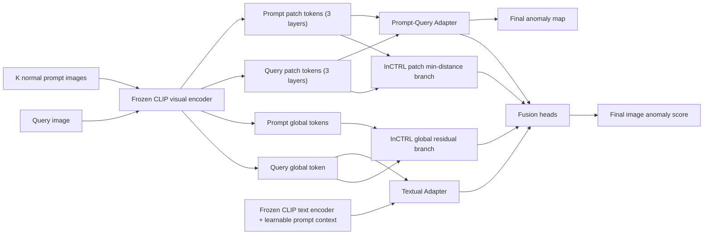

# InCTRL + TA + PQA Design

## Goal

Preserve the original InCTRL residual-comparison backbone, then add:

- `TA` (Textual Adapter): learnable normal/anomaly text prompts
- `PQA` (Prompt-Query Adapter): aligned prompt-query comparison branch with contextual residuals

The key principle is:

- keep `InCTRL` as the stable base scorer
- do **not** rewrite the original residual geometry
- add `TA` and `PQA` as side branches
- train `TA` and `PQA` **alternately**, not fully jointly

## Architecture



## Branches

### 1. InCTRL base branch

Keep the current official logic unchanged:

- global residual score:
  - `token_ref = mean(Adapter(p_i)) - Adapter(q)`
- local residual map:
  - for each query patch, compute min distance to all prompt patches
- original outputs:
  - `s_inctrl`
  - `m_inctrl` as the original patch residual map

This branch should start from the restored official checkpoint and stay frozen during early TA/PQA training.

### 2. TA branch

Use learnable prompt context, but do not alter the visual encoder.

For category `c`:

- learnable normal prompt:
  - `T_pos(c) = [ctx_pos] + template(normal, c)`
- learnable anomaly prompt:
  - `T_neg(c) = [ctx_neg] + template(anomaly, c)`

Text branch score:

- `z_ta = gamma * [q_cls dot t_pos, q_cls dot t_neg]`
- `s_ta = softmax(z_ta)[anomaly]`

Recommended design:

- initialize with the same handcrafted templates as original InCTRL
- only learn context tokens `ctx_pos`, `ctx_neg`
- keep CLIP text encoder frozen

### 3. PQA branch

The PQA branch should compare query patches with **aligned** prompt patches, not raw prompt patches.

For each layer `l`:

- query patch tokens:
  - `Q_l in R^(B x N x D)`
- prompt patch tokens:
  - `P_l in R^(B x K x N x D)`
- flatten prompt patches:
  - `P'_l in R^(B x (K*N) x D)`

#### 3.1 Patch alignment

Use lightweight cross-attention or nearest-neighbor alignment:

- `A_l = softmax((Q_l W_q)(P'_l W_k)^T / sqrt(D))`
- `P_align_l = A_l (P'_l W_v)`

If you want the lowest-risk version, start with:

- no multi-head transformer block
- one linear `W_q`, one linear `W_k`, one linear `W_v`

#### 3.2 Contextual residual fusion

Build AdaptCLIP-style contextual residuals:

- `R_l = |Q_l - P_align_l|`
- `C_l = Q_l + alpha * R_l`

Safer alternative:

- `C_l = LayerNorm(Q_l + alpha * R_l)`

Avoid replacing the original InCTRL patch matching with this branch.
Treat it as a parallel branch.

#### 3.3 PQA outputs

For each layer `l`:

- local map head:
  - `m_pqa_l = ConvHead(C_l)`
- global score head:
  - pool `C_l` with `mean + topk`
  - `s_pqa_l = MLP(pool(C_l))`

Aggregate across layers:

- `m_pqa = mean_l(m_pqa_l)`
- `s_pqa = mean_l(s_pqa_l)`

## Fusion

### Image-level fusion

Use a tiny fusion MLP on three scores:

- input:
  - `[s_inctrl, s_ta, s_pqa]`
- output:
  - `s_final`

Recommended form:

- `s_final = MLP([s_inctrl, s_ta, s_pqa])`

For the first version, initialize fusion conservatively:

- `s_final = 0.6 * s_inctrl + 0.2 * s_ta + 0.2 * s_pqa`

Then optionally learn the fusion head later.

### Pixel-level fusion

Use only InCTRL residual map and PQA map:

- `m_final = beta * normalize(m_inctrl) + (1 - beta) * normalize(m_pqa)`

Recommended initial value:

- `beta = 0.5`

## Loss design

Let:

- `y in {0,1}` be image-level label
- `G` be binary mask on source datasets with segmentation labels

### 1. Base image loss

Keep original InCTRL image loss:

- `L_inctrl = Focal(s_inctrl, y) + Focal(s_ref, y)`

where `s_ref` is the original `img_ref_score`.

### 2. TA loss

Use classification loss only:

- `L_ta = CE(z_ta, y)`

Optional consistency loss:

- `L_ta_cons = BCE(s_ta, stopgrad(s_inctrl > tau))`

For the first implementation, `L_ta` alone is enough.

### 3. PQA image loss

For each layer score:

- `L_pqa_cls = mean_l CE(s_pqa_l, y)`

or, if the score is already sigmoid:

- `L_pqa_cls = mean_l Focal(s_pqa_l, y)`

### 4. PQA segmentation loss

On source datasets with masks:

- `L_pqa_seg = mean_l [lambda_f * Focal(m_pqa_l, G) + lambda_d * Dice(m_pqa_l, G)]`

Recommended starting weights:

- `lambda_f = 1.0`
- `lambda_d = 1.0`

### 5. Fusion loss

Final image score:

- `L_final = Focal(s_final, y)`

Optional final map loss:

- `L_map = Focal(m_final, G) + Dice(m_final, G)`

### 6. Total loss

Recommended total:

`L = w1 * L_inctrl + w2 * L_ta + w3 * L_pqa_cls + w4 * L_pqa_seg + w5 * L_final + w6 * L_map`

Recommended initial weights:

- `w1 = 1.0`
- `w2 = 0.5`
- `w3 = 0.5`
- `w4 = 1.0`
- `w5 = 1.0`
- `w6 = 0.5`

If the source dataset has no mask, drop `L_pqa_seg` and `L_map`.

## Training schedule

Do not train everything jointly from scratch.

### Stage 0. Base initialization

- load the restored official InCTRL checkpoint
- freeze CLIP visual encoder
- freeze CLIP text encoder
- optionally freeze original InCTRL branch for the first TA/PQA warmup

### Stage 1. TA warmup

Train only:

- `ctx_pos`
- `ctx_neg`
- optional TA projection head

Freeze:

- InCTRL base branch
- PQA branch
- fusion head

Loss:

- `L_ta`

### Stage 2. PQA warmup

Train only:

- patch aligner
- PQA global head
- PQA local head

Freeze:

- InCTRL base branch
- TA branch
- fusion head

Loss:

- `L_pqa_cls + L_pqa_seg`

### Stage 3. Alternating optimization

Alternate by epoch:

- odd epochs: update TA branch
- even epochs: update PQA branch

Keep InCTRL base frozen.

Loss:

- TA epoch:
  - `L_ta + 0.5 * L_final`
- PQA epoch:
  - `L_pqa_cls + L_pqa_seg + 0.5 * L_final`

### Stage 4. Fusion tuning

Train only:

- image fusion MLP
- optional map fusion head

Freeze:

- InCTRL
- TA
- PQA

Loss:

- `L_final + L_map`

## Minimal implementation plan

### New modules

Add:

- `open_clip/textual_adapter.py`
- `open_clip/pq_adapter.py`

### Changes in `open_clip/model.py`

Keep current restored official `InCTRL` as the default path, then later add optional:

- `self.textual_adapter`
- `self.pq_adapter`
- `self.score_fusion_head`
- `self.map_fusion_head`

Recommended forward API:

```python
outputs = model(
    tokenizer,
    inputs,
    types,
    normal_list=None,
    return_aux=True,
)
```

Return:

- `s_inctrl`
- `m_inctrl`
- `s_ta`
- `s_pqa`
- `m_pqa`
- `s_final`
- `m_final`

### New config blocks

When you start the next implementation round, add:

- `TEXTUAL_ADAPTER`
- `PQ_ADAPTER`
- `FUSION`

Do not reintroduce the old `VISUAL_ADAPTER` block.

## Recommended first ablation order

Run in this order:

1. `InCTRL + TA`
2. `InCTRL + PQA(global only)`
3. `InCTRL + PQA(global + local)`
4. `InCTRL + TA + PQA`
5. `InCTRL + TA + PQA + learned fusion`

This order makes it easier to isolate whether gains come from:

- learned text priors
- aligned prompt-query comparison
- final multi-branch fusion

## Practical notes

- Keep the original InCTRL residual branch as the anchor branch.
- Do not apply PQA-adapted features back into the original InCTRL patch min-distance path.
- Use source-domain masks only to supervise `PQA` local heads, not to rewrite the InCTRL branch.
- If training becomes unstable, reduce `w2` and `w3` first before touching `w1`.
- If image AUROC improves but segmentation degrades, decrease `alpha` in `C_l = Q_l + alpha * |Q_l - P_align_l|`.
